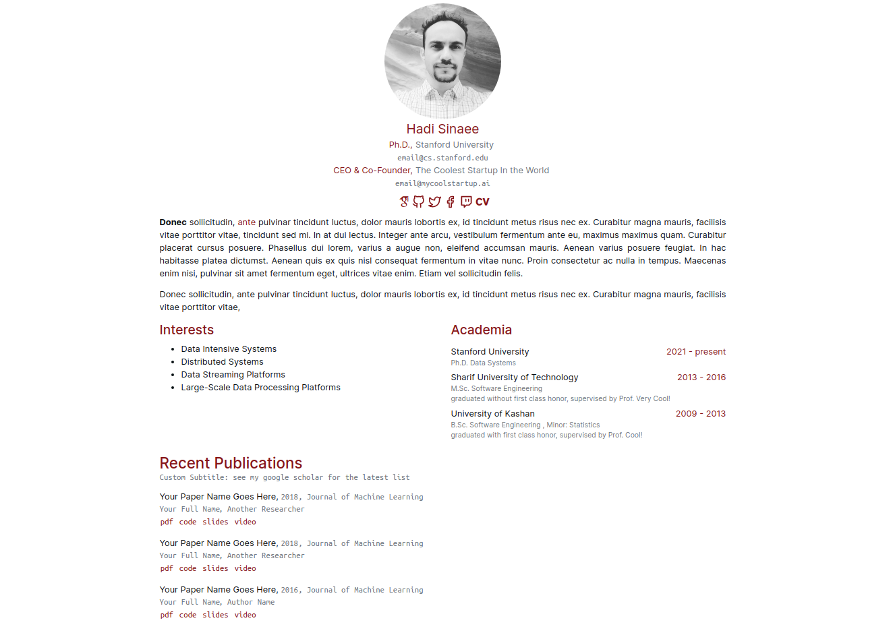

# Avicenna Theme
A minimal academic page for academics built with Hugo.

> This theme hugely benefits from `Ezhil Theme`. I just made some changes to create `avicenna`.
> __NOTE: I will review all the pull requests in the second half of Nov. 2019. Thanks for your contributions :v:__



# Features
* Minimal, Responsive, and Clean
* Single File Configuration
* Supports Social Links
* Supports Publication Listing
* Supports Project Listing
* Supports Google Analytics
* Supports Hugo RSS feeds

# How To Install `Avicenna`?
> I assume that you know to start with `Hugo`. If you do not know how to run a website with `Hugo`, please read its [quick start](https://gohugo.io/getting-started/quick-start/).

See the full setup in ~70 seconds:
[](https://asciinema.org/a/7ZReSH0ws7HVbI1c6UUN7wzfd)

Or simply follow the instructions:
```bash
# creates a static site
$ hugo new site my-academic-page
$ cd my-academic-page
$ cd themes
$ git clone https://github.com/hadisinaee/avicenna.git
$ cd ..
$ cp ./themes/avicenna/exampleSite/config.toml ./
$ cp Path/To/YourPrile/profile.jpg ./static/profile.jpg
$ hugo server
```

# Sample Configuration

To kick start, copy the following configuration and paste it in `config.toml` file in your root directory.

__IMPORTANT__
 - copy your profile picture and name it `profile.jpg` in the `static` folder
 - copy your CV file in the `static` folder. Set the `cv_name` variable to its full file name.

```toml
baseURL = "https://example.edu"
languageCode = "en-us"
title = "Hadi Sinaee"
theme = "avicenna"
googleAnalytics = "UA-1234-6"
timeout=3000

[params]
  subtitle= "PhD Student"
  interests="Deep Reinforcement Learning, Machine Learning "
  cv_name= "HadiSinaee_CV.pdf"
  blog="http://myblog.edu"

[[params.affilation]]
  name = "Stanford University"
  position = "PhD Student"
  contact = "hadi@cs.stanford.edu"

[[params.affilation]]
  name = "MyCoolStartup"
  position = "Co-Founder"
  contact = "hadi@mycoolstartup.ai"

[[params.social]]
  name = "GitHub"
  icon = "github"
  url = "https://github.com/hadisinaee"

[[params.social]]
  name = "Twitter"
  icon = "twitter"
  url = "https://twitter.com/hadisinaee"


[[params.social]]
  name = "LinkedIn"
  icon = "linkedin"
  url = "https://linkedin.com/in/hadisinaee/"


[[params.introduction.paragraph]]
  text="""Lorem ipsum dolor sit amet, consectetur adipiscing elit, sed do eiusmod tempor incididunt ut labore et dolore magna aliqua.
	 Nunc scelerisque viverra mauris in aliquam sem fringilla ut morbi. Integer feugiat scelerisque varius morbi enim.
	  A diam maecenas sed enim ut sem viverra. Orci eu lobortis elementum nibh tellus.
		Egestas sed sed risus pretium quam vulputate dignissim suspendisse in.
		Accumsan sit amet nulla facilisi morbi tempus iaculis urna. Condimentum lacinia quis vel eros donec.
   """
[[params.introduction.paragraph]]
  text=""" Pellentesque nec nam aliquam sem et tortor consequat id porta.
	Viverra suspendisse potenti nullam ac. Leo vel orci porta non pulvinar neque laoreet.
	Nulla facilisi nullam vehicula ipsum a arcu. Tempus egestas sed sed risus pretium quam vulputate dignissim suspendisse.
	Ullamcorper velit sed ullamcorper morbi tincidunt ornare. Dui sapien eget mi proin sed libero.
	Quam pellentesque nec nam aliquam sem et tortor consequat id. Aliquet lectus proin nibh nisl.
  """


[[params.projects]]
	[[params.projects.project]]
		name = "Velit egestas dui id ornare arcu odio ut sem. Nec nam aliquam sem et tortor"
		description  = "Enim facilisis gravida neque convallis a. Suspendisse potenti nullam ac tortor vitae purus faucibus ornare suspendisse.Velit egestas dui id ornare arcu odio ut sem. Nec nam aliquam sem et tortor. In nisl nisi scelerisque eu ultrices vitae auctor."
		project_page = "https://myprojecthomepage.com"
		code_link = "https://coderepo.com"
		blog_link = "https://ablogpost.com"

 [[params.projects.project]]
		name = "In nisl nisi scelerisque eu ultrices vitae auctor"
		description  = ""
		project_page = "https://myprojecthomepage.com"
		code_link = "https://coderepo.com"
		blog_link = ""

 [[params.projects.project]]
		name = "Integer eget aliquet nibh praesent tristique magna"
		description  = ""
		project_page = "https://myprojecthomepage.com"
		code_link = ""
		blog_link = "https://ablogpost.com"

[[params.publications]]
  year="Preprint"

  [[params.publications.paper]]
    name = "Enim nunc faucibus a pellentesque sit amet porttitor"
    authors = "Ana Alvardo, William Worthley, __Hadi Sinaee__"
    dest  = "Helga Zita Journal"
    link = "https://mypaperishere.com"
    code_link = "https://thecoderepo.com"
    blog_link = "https://myblogaboutit.com"

  [[params.publications.paper]]
    name = "In cursus turpis massa tincidunt dui ut ornare lectus sit"
    authors = "__Hadi Sinaee__,Les Larkins, Edra Ethier"
    dest  = "Meklit Katlego Conference"
    link = "https://mypaperishere.com"
    code_link = "https://thecoderepo.com"
    blog_link = "https://myblogaboutit.com"

[[params.publications]]
  year="2019"

  [[params.publications.paper]]
		name = "Feugiat sed lectus vestibulum mattis ullamcorper velit sed"
		authors = "Caroll Comes, __Hadi Sinaee__"
		dest  = "Udo Madhu Journal"
		link = "https://mypaperishere.com"
		code_link = "https://thecoderepo.com"
		blog_link = ""

  [[params.publications.paper]]
		name = "Venenatis urna cursus eget nunc. Nam aliquam sem et tortor consequat id porta nibh venenatis"
		authors = "Les Larkins, Ana Alvardo, __Hadi Sinaee__ "
		dest  = "Zorka Vita Conference"
		link = "https://mypaperishere.com"
		code_link = ""
		blog_link = "https://myblogaboutit.com"

  [[params.publications.paper]]
		name = "Aliquet eget sit amet tellus cras adipiscing enim eu turpis"
		authors = "Les Larkins, __Hadi Sinaee__, Ana Alvardo"
		dest  = "Lena Randa Conference"
		link = "https://mypaperishere.com"
		code_link = ""
		blog_link = ""

  [[params.publications.paper]]
		name = "Orci eu lobortis elementum nibh tellus molestie nunc non blandit"
		authors = "__Hadi Sinaee__, Caroll Comes"
		dest  = "Thandeka Radhika Conference"
		link = ""
		code_link = ""
		blog_link = ""

```

# Any Idea?
I am using `Avicenna` for my personal uses. Therefore, I will update it regularly. If you need something that doesn't exist, let's discuss it over an issue :)

# Credits
* [Ezhil Theme](https://github.com/vividvilla/ezhil)
* [Feather Icons](https://feathericons.com/)
